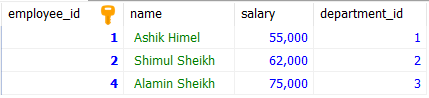
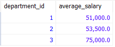
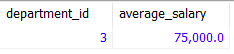

# Lab Report 03
**Course:** Database Management System Sessional (CSEC-322)<br />

**Prepared By:**<br />
Ashikujjaman Himel<br />
ID: 2222081021<br />
Batch: 57A Day<br />
Semester: Fall-2024<br />

## Create and Use Database
```sql
CREATE DATABASE xyz_company;
USE xyz_company;
```

## Create Tables
```sql
CREATE TABLE employees (
	employee_id INT PRIMARY KEY NOT NULL,
	name VARCHAR(50),
	salary INT,
	department_id INT
);

CREATE TABLE departments (
	department_id INT PRIMARY KEY NOT NULL,
	department_name VARCHAR(50)
);

CREATE TABLE customers (
	customer_id INT PRIMARY KEY NOT NULL,
	name VARCHAR(50)
);

CREATE TABLE orders (
	order_id INT PRIMARY KEY NOT NULL,
	customer_id INT,
	amount INT,
	FOREIGN KEY (customer_id) REFERENCES customers(customer_id)
);

CREATE TABLE products (
	product_id INT PRIMARY KEY NOT NULL,
	product_name VARCHAR(50),
	category_id INT
);
```

## Insert Sample Data
```sql
INSERT INTO employees (employee_id, name, salary, department_id) VALUES
(1, 'Alice Johnson', 55000, 1),
(2, 'Bob Smith', 62000, 2),
(3, 'Charlie Brown', 47000, 1),
(4, 'Daisy White', 75000, 3),
(5, 'Edward Green', 45000, 2);

INSERT INTO departments (department_id, department_name) VALUES
(1, 'Human Resources'),
(2, 'Engineering'),
(3, 'Marketing');

INSERT INTO customers (customer_id, name) VALUES
(1, 'Alice Anderson'),
(2, 'Bob Black'),
(3, 'Carol White'),
(4, 'David Brown'),
(5, 'Eve Gray');

INSERT INTO orders (order_id, customer_id, amount) VALUES
(1, 1, 200),
(2, 2, 150),
(3, 3, 300),
(4, 4, 500),
(5, 5, 120);

INSERT INTO products (product_id, product_name, category_id) VALUES
(1, 'Product A', 101),
(2, 'Product B', 102),
(3, 'Product C', 103),
(4, 'Product D', 101),
(5, 'Product E', 104);
```

## Task 1: Using WHERE Clause Retrieve all employees with a salary greater than 50,000.
```sql
SELECT * FROM employees
WHERE salary > 50000;
```
### Output of Task 1


## Task 2: Using LIKE Operator Retrieve all customers whose names start with 'A'.
```sql
SELECT * FROM customers
WHERE name LIKE 'A%';
```
### Output of Task 2


## Task 3: Using GROUP BY Clause Group employees by department and calculate the average salary.
```sql
SELECT department_id, AVG(salary) AS average_salary
FROM employees
GROUP BY department_id;
```
### Output of Task 3


## Task 4: Using HAVING Clause Retrieve departments with an average salary greater than 60,000.
```sql
SELECT department_id, AVG(salary) AS average_salary
FROM employees
GROUP BY department_id
HAVING AVG(salary) > 60000;
```
### Output of Task 4


## Task 5: Using IN Operator Retrieve all orders placed by customers with IDs 1, 2, and 3.
```sql
SELECT * FROM orders
WHERE customer_id IN (1, 2, 3);
```
### Output of Task 5


## Task 6: Using NOT IN Operator Retrieve all products that are not in categories 1, 2, and 3.
```sql
SELECT * FROM products
WHERE category_id NOT IN (1, 2, 3);
```
### Output of Task 6


## Task 7: Using Subqueries etrieve all employees who work in a department with more than 10 employees.
```sql
SELECT * FROM employees
WHERE department_id IN (
	SELECT department_id
	FROM employees
	GROUP BY department_id
	HAVING COUNT(*) > 10
);
```
### Output of Task 7
